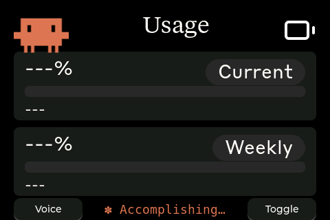

# Clawdmeter (Guition JC3248W535 Port)

A small ESP32 dashboard I made for my desk to keep an eye on Claude Code usage.

This is a dedicated fork for the **Guition JC3248W535** (also known as the DIYmalls 3.5" ESP32-S3 HMI board). It pairs with your laptop over Bluetooth to display your Claude Code usage in real-time.

|              Usage meter              |              Clawd animation screen              |
| :-----------------------------------: | :----------------------------------------------: |
|  |  |

The splash screen plays pixel-art Clawd animations that get busier when your usage rate climbs. The animations come from [claudepix](https://claudepix.vercel.app), [@amaanbuilds](https://x.com/amaanbuilds)'s library of pixel-art Clawd sprites.

## Screens

- **Usage Dashboard**: Displays session and weekly utilization, reset timers, and an activity spinner.
- **Bluetooth Status**: Shows connection state, device name, and MAC address.
- **Splash Screen**: Plays animations based on usage rate.

**Interaction**:
- **Tap the Claude Logo** (top left) to cycle between the Usage and Bluetooth screens.
- **Tap the Background** to toggle the Splash Animation.
- **On-screen "Voice" button**: Hold to trigger Claude Code's voice mode (`Space`).
- **On-screen "Toggle" button**: Tap to switch Claude Code modes (`Shift+Tab`).

## Hardware

- **Guition JC3248W535**: ESP32-S3-WROOM-1, 3.5" 320x480 IPS Display (AXS15231B).
- **8MB OPI PSRAM**: Used for full-frame buffering to ensure glitch-free rendering.
- **Capacitive Touch**: Fully calibrated for landscape interaction.
- **Backlight**: Controlled via PWM on GPIO 1.
- **Battery Meter**: ⚠️ **Not yet wired up.** This board lacks a PMU; battery monitoring requires an external voltage divider connected to an ADC pin.

## Installation (Linux)

### 1. Flash the firmware

```bash
cd firmware
pio run -e jc3248w535 -t upload
```

### 2. Pair the device

The device advertises as **"Claude Controller"**. 

```bash
# Scan for the device
bluetoothctl scan le

# Pair and trust (replace with your board's MAC)
bluetoothctl pair 8C:BF:EA:0D:B3:11
bluetoothctl trust 8C:BF:EA:0D:B3:11
```

### 3. Install the daemon

The daemon polls your Claude usage every 60 seconds and sends it to the display over BLE.

```bash
cd daemon
# Update the path in the service file
sed -i "s|ExecStart=DAEMON_PATH|ExecStart=$HOME/Clawdmeter/daemon/claude-usage-daemon.sh|" claude-usage-daemon.service

# Install as a user service
mkdir -p ~/.config/systemd/user/
cp claude-usage-daemon.service ~/.config/systemd/user/
systemctl --user daemon-reload
systemctl --user enable --now claude-usage-daemon.service
```

## How it works

1. The daemon reads your Claude Code OAuth token from `~/.claude/.credentials.json`.
2. It polls the Anthropic API for usage headers.
3. The data is sent to the ESP32 over BLE GATT.
4. The firmware (running LVGL 9) renders the dashboard. A manual pixel transformation fix is used in the flush callback to bypass driver-level rotation bugs, ensuring a perfect 480x320 landscape image.
5. The on-screen buttons act as a BLE HID keyboard to send shortcuts to your PC.

## Credits

- Pixel-art Clawd animation by [@amaanbuilds](https://x.com/amaanbuilds), sourced from [claudepix.vercel.app](https://claudepix.vercel.app).
- Lucide icon set ([lucide.dev](https://lucide.dev), MIT) for UI glyphs.
- Porting and hardware adaptation by Gemini CLI.

## Licensing gray area warning

The software in this repository uses and adheres to the Anthropic brand guidelines and uses the same proprietary fonts that Anthropic has a license for but this software uses without permission as well as using assets from Anthropic such as the copyrighted Clawd mascot so even though the code in this repo is non-proprietary I will not license it myself under a copyleft license since this repo includes proprietary fonts and copyrighted assets. Please be aware of this if you fork or copy the code from this repo. **You have been warned!**
